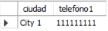
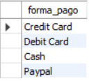
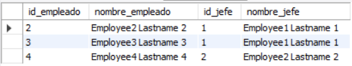
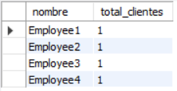
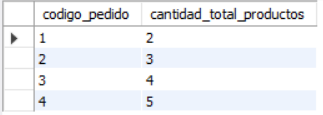
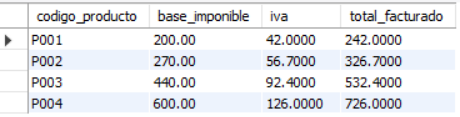
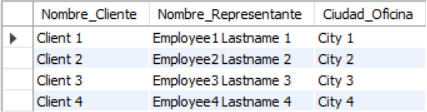
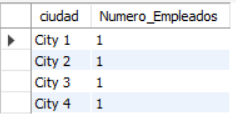

# Taller 3 creación y normalización base de datos 

```sql
-- Schema mydb
-- -----------------------------------------------------
CREATE SCHEMA IF NOT EXISTS `mydb` DEFAULT CHARACTER SET utf8 ;
-- -----------------------------------------------------
-- Schema holamundo
-- -----------------------------------------------------
USE `mydb` ;

-- -----------------------------------------------------
-- Table `mydb`.`dimension`
-- -----------------------------------------------------
CREATE TABLE IF NOT EXISTS `mydb`.`dimension` (
  `dimensiones_ID` INT NOT NULL,
  `ancho` DECIMAL(15,2) NOT NULL,
  `largo` DECIMAL(15,2) NOT NULL,
  `alto` DECIMAL(15,2) NOT NULL,
  PRIMARY KEY (`dimensiones_ID`))
ENGINE = InnoDB;


-- -----------------------------------------------------
-- Table `mydb`.`gama_producto`
-- -----------------------------------------------------
CREATE TABLE IF NOT EXISTS `mydb`.`gama_producto` (
  `gama` VARCHAR(50) NOT NULL,
  `descriptacion_texto` TEXT NULL,
  `descripcion_html` TEXT NULL,
  `imagen` VARCHAR(256) NULL,
  PRIMARY KEY (`gama`))
ENGINE = InnoDB;


-- -----------------------------------------------------
-- Table `mydb`.`producto`
-- -----------------------------------------------------
CREATE TABLE IF NOT EXISTS `mydb`.`producto` (
  `codigo_producto` VARCHAR(15) NOT NULL,
  `nombre` VARCHAR(70) NOT NULL,
  `gama` VARCHAR(50) NOT NULL,
  `descripcion` TEXT NULL,
  `cantidad_en_stock` SMALLINT(6) NOT NULL,
  `precio_venta` DECIMAL(15,2) NOT NULL,
  `precio_proveedor` DECIMAL(15,2) NULL,
  `dimensiones_ID` INT NOT NULL,
  PRIMARY KEY (`codigo_producto`),
  INDEX `dimensiones_ID_idx` (`dimensiones_ID` ASC) VISIBLE,
  INDEX `gama_idx` (`gama` ASC) VISIBLE,
  CONSTRAINT `dimensiones_ID`
    FOREIGN KEY (`dimensiones_ID`)
    REFERENCES `mydb`.`dimension` (`dimensiones_ID`)
    ON DELETE NO ACTION
    ON UPDATE NO ACTION,
  CONSTRAINT `gama`
    FOREIGN KEY (`gama`)
    REFERENCES `mydb`.`gama_producto` (`gama`)
    ON DELETE NO ACTION
    ON UPDATE NO ACTION)
ENGINE = InnoDB;


-- -----------------------------------------------------
-- Table `mydb`.`proveedor`
-- -----------------------------------------------------
CREATE TABLE IF NOT EXISTS `mydb`.`proveedor` (
  `provedores_ID` INT NOT NULL,
  `nombre` VARCHAR(45) NOT NULL,
  `telefono` INT NOT NULL,
  `direccion` VARCHAR(45) NULL,
  PRIMARY KEY (`provedores_ID`))
ENGINE = InnoDB;


-- -----------------------------------------------------
-- Table `mydb`.`proveedor_has_producto`
-- -----------------------------------------------------
CREATE TABLE IF NOT EXISTS `mydb`.`proveedor_has_producto` (
  `proveedor_provedores_ID` INT NOT NULL,
  `producto_codigo_producto` VARCHAR(15) NOT NULL,
  PRIMARY KEY (`proveedor_provedores_ID`, `producto_codigo_producto`),
  INDEX `fk_proveedor_has_producto_producto1_idx` (`producto_codigo_producto` ASC) VISIBLE,
  INDEX `fk_proveedor_has_producto_proveedor1_idx` (`proveedor_provedores_ID` ASC) VISIBLE,
  CONSTRAINT `fk_proveedor_has_producto_proveedor1`
    FOREIGN KEY (`proveedor_provedores_ID`)
    REFERENCES `mydb`.`proveedor` (`provedores_ID`)
    ON DELETE NO ACTION
    ON UPDATE NO ACTION,
  CONSTRAINT `fk_proveedor_has_producto_producto1`
    FOREIGN KEY (`producto_codigo_producto`)
    REFERENCES `mydb`.`producto` (`codigo_producto`)
    ON DELETE NO ACTION
    ON UPDATE NO ACTION)
ENGINE = InnoDB;


-- -----------------------------------------------------
-- Table `mydb`.`ubicacion`
-- -----------------------------------------------------
CREATE TABLE IF NOT EXISTS `mydb`.`ubicacion` (
  `ubicacion_oficina` INT NOT NULL,
  `ciudad` VARCHAR(45) NOT NULL,
  `region` VARCHAR(45) NULL,
  `codigo_postal` INT NOT NULL,
  `pais` VARCHAR(45) NOT NULL,
  PRIMARY KEY (`ubicacion_oficina`))
ENGINE = InnoDB;


-- -----------------------------------------------------
-- Table `mydb`.`oficina`
-- -----------------------------------------------------
CREATE TABLE IF NOT EXISTS `mydb`.`oficina` (
  `codigo_oficina` INT NOT NULL,
  `ubicacion_ID` INT NOT NULL,
  `telefono_ID` INT NOT NULL,
  `direccion_ID` INT NOT NULL,
  PRIMARY KEY (`codigo_oficina`),
  INDEX `INDEX` (`direccion_ID` ASC, `telefono_ID` ASC, `ubicacion_ID` ASC) VISIBLE,
  INDEX `ubicacion_oficina_idx` (`ubicacion_ID` ASC) VISIBLE,
  CONSTRAINT `ubicacion_oficina`
    FOREIGN KEY (`ubicacion_ID`)
    REFERENCES `mydb`.`ubicacion` (`ubicacion_oficina`)
    ON DELETE NO ACTION
    ON UPDATE NO ACTION)
ENGINE = InnoDB;

ALTER TABLE `mydb`.`oficina` ADD INDEX `telefono_ID_idx` (`telefono_ID` ASC);


-- -----------------------------------------------------
-- Table `mydb`.`empleado`
-- -----------------------------------------------------
CREATE TABLE IF NOT EXISTS `mydb`.`empleado` (
  `codigo_empleado` INT NOT NULL,
  `nombre_ID` INT NOT NULL,
  `extension` INT(5) NOT NULL,
  `email` VARCHAR(45) NOT NULL,
  `codigo_oficina` INT NOT NULL,
  `codigo_jefe` INT(11) NOT NULL,
  `puesto` VARCHAR(50) NULL,
  PRIMARY KEY (`codigo_empleado`),
  INDEX `INDEX` (`nombre_ID` ASC, `codigo_jefe` ASC, `codigo_oficina` ASC) INVISIBLE,
  INDEX `codigo_oficina_idx` (`codigo_oficina` ASC) VISIBLE,
  CONSTRAINT `codigo_jefe`
    FOREIGN KEY (`codigo_empleado`)
    REFERENCES `mydb`.`empleado` (`codigo_jefe`)
    ON DELETE NO ACTION
    ON UPDATE NO ACTION,
  CONSTRAINT `codigo_oficina`
    FOREIGN KEY (`codigo_oficina`)
    REFERENCES `mydb`.`oficina` (`codigo_oficina`)
    ON DELETE NO ACTION
    ON UPDATE NO ACTION)
ENGINE = InnoDB;


-- -----------------------------------------------------
-- Table `mydb`.`cliente`
-- -----------------------------------------------------
CREATE TABLE IF NOT EXISTS `mydb`.`cliente` (
  `codigo_cliente` INT(11) NOT NULL,
  `nombre_cliente` VARCHAR(50) NOT NULL,
  `contacto_ID` INT(11) NOT NULL,
  `telefono_ID` INT NOT NULL,
  `contacto_ID` INT(11) NOT NULL,
  `codigo_emp_rep_ventas` INT(11) NOT NULL,
  `limite_credito_ID` INT(11) NOT NULL,
  `direccion_ID` INT(11) NOT NULL,
  PRIMARY KEY (`codigo_cliente`),
  INDEX `INDEX` (`contacto_ID` ASC, `telefono_ID` ASC, `contacto_ID` ASC, `direccion_ID` ASC, `limite_credito_ID` ASC) VISIBLE,
  INDEX `fk_cliente_empleado1_idx` (`codigo_emp_rep_ventas` ASC) VISIBLE,
  CONSTRAINT `fk_cliente_empleado1`
    FOREIGN KEY (`codigo_emp_rep_ventas`)
    REFERENCES `mydb`.`empleado` (`codigo_empleado`)
    ON DELETE NO ACTION
    ON UPDATE NO ACTION)
ENGINE = InnoDB;


-- -----------------------------------------------------
-- Table `mydb`.`pedido`
-- -----------------------------------------------------
CREATE TABLE IF NOT EXISTS `mydb`.`pedido` (
  `codigo_pedido` INT(11) NOT NULL,
  `fecha_pedido` DATE NOT NULL,
  `fecha_esperada` DATE NOT NULL,
  `fecha_entrega` DATE NULL,
  `estado` VARCHAR(15) NOT NULL,
  `comentarios` TEXT NULL,
  `codigo_cliente` INT(11) NOT NULL,
  PRIMARY KEY (`codigo_pedido`),
  INDEX `fk_pedido_cliente1_idx` (`codigo_cliente` ASC) VISIBLE,
  CONSTRAINT `cliente_codigo`
    FOREIGN KEY (`codigo_cliente`)
    REFERENCES `mydb`.`cliente` (`codigo_cliente`)
    ON DELETE NO ACTION
    ON UPDATE NO ACTION)
ENGINE = InnoDB;


-- -----------------------------------------------------
-- Table `mydb`.`detalle_pedido`
-- -----------------------------------------------------
CREATE TABLE IF NOT EXISTS `mydb`.`detalle_pedido` (
  `codigo_pedido` INT(11) NOT NULL,
  `codigo_producto` VARCHAR(15) NOT NULL,
  `cantidad` INT(11) NOT NULL,
  `precio_unidad` DECIMAL(15,2) NOT NULL,
  `numero_linea` SMALLINT(6) NOT NULL,
  PRIMARY KEY (`codigo_producto`),
  INDEX `fk_detalle_pedido_pedido1_idx` (`codigo_pedido` ASC) VISIBLE,
  CONSTRAINT `codigo_producto`
    FOREIGN KEY (`codigo_producto`)
    REFERENCES `mydb`.`producto` (`codigo_producto`)
    ON DELETE NO ACTION
    ON UPDATE NO ACTION,
  CONSTRAINT `codigo_pedido`
    FOREIGN KEY (`codigo_pedido`)
    REFERENCES `mydb`.`pedido` (`codigo_pedido`)
    ON DELETE NO ACTION
    ON UPDATE NO ACTION)
ENGINE = InnoDB;


-- -----------------------------------------------------
-- Table `mydb`.`direccion_ID`
-- -----------------------------------------------------
CREATE TABLE IF NOT EXISTS `mydb`.`direccion_ID` (
  `direccion_ID` INT(11) NOT NULL,
  `calle` VARCHAR(45) NOT NULL,
  `carrera` VARCHAR(45) NOT NULL,
  `ciudad` VARCHAR(45) NOT NULL,
  `departamento` VARCHAR(45) NOT NULL,
  `pais` VARCHAR(45) NOT NULL,
  `region` VARCHAR(45) NULL,
  `codigo_portal` INT NOT NULL,
  PRIMARY KEY (`direccion_ID`),
  CONSTRAINT `direccion_ID`
    FOREIGN KEY (`direccion_ID`)
    REFERENCES `mydb`.`cliente` (`direccion_ID`)
    ON DELETE NO ACTION
    ON UPDATE NO ACTION)
ENGINE = InnoDB;


-- -----------------------------------------------------
-- Table `mydb`.`limite_credito`
-- -----------------------------------------------------
CREATE TABLE IF NOT EXISTS `mydb`.`limite_credito` (
  `limite_credito_ID` INT(11) NOT NULL,
  `codigo_cliente` INT NULL,
  `limite_credito` DECIMAL(15,2) NULL,
  PRIMARY KEY (`limite_credito_ID`),
  CONSTRAINT `limite_credito`
    FOREIGN KEY (`limite_credito_ID`)
    REFERENCES `mydb`.`cliente` (`limite_credito_ID`)
    ON DELETE NO ACTION
    ON UPDATE NO ACTION)
ENGINE = InnoDB;


-- -----------------------------------------------------
-- Table `mydb`.`contacto`
-- -----------------------------------------------------
CREATE TABLE IF NOT EXISTS `mydb`.`contacto` (
  `contacto_ID` INT NOT NULL,
  `nombre_contacto` VARCHAR(45) NULL,
  `apellido_contacto` VARCHAR(45) NULL,
  PRIMARY KEY (`contacto_ID`),
  CONSTRAINT `contacto_ID`
    FOREIGN KEY (`contacto_ID`)
    REFERENCES `mydb`.`cliente` (`contacto_ID`)
    ON DELETE NO ACTION
    ON UPDATE NO ACTION)
ENGINE = InnoDB;


-- -----------------------------------------------------
-- Table `mydb`.`telefono`
-- -----------------------------------------------------
CREATE TABLE IF NOT EXISTS `mydb`.`telefono` (
  `telefono_ID` INT NOT NULL,
  `telefono1` INT NOT NULL,
  `telefono2` INT NULL,
  `fax` INT NULL,
  PRIMARY KEY (`telefono_ID`),
  CONSTRAINT `telefono_ID`
    FOREIGN KEY (`telefono_ID`)
    REFERENCES `mydb`.`cliente` (`telefono_ID`)
    ON DELETE NO ACTION
    ON UPDATE NO ACTION)
ENGINE = InnoDB;


-- -----------------------------------------------------
-- Table `mydb`.`pago`
-- -----------------------------------------------------
CREATE TABLE IF NOT EXISTS `mydb`.`pago` (
  `codigo_cliente` INT(11) NOT NULL,
  `forma_pago` VARCHAR(40) NULL,
  `id_transaccion` VARCHAR(50) NULL,
  `fecha_pago` DATE NULL,
  `total` DECIMAL(15,2) NULL,
  PRIMARY KEY (`codigo_cliente`),
  CONSTRAINT `codigo_cliente`
    FOREIGN KEY (`codigo_cliente`)
    REFERENCES `mydb`.`cliente` (`codigo_cliente`)
    ON DELETE NO ACTION
    ON UPDATE NO ACTION)
ENGINE = InnoDB;


-- -----------------------------------------------------
-- Table `mydb`.`nombre empleado`
-- -----------------------------------------------------
CREATE TABLE IF NOT EXISTS `mydb`.`nombre empleado` (
  `nombre_ID` INT NOT NULL,
  `nombre` VARCHAR(45) NULL,
  `apellido1` VARCHAR(45) NULL,
  `apellido2` VARCHAR(45) NULL,
  PRIMARY KEY (`nombre_ID`),
  INDEX `nombre_ID_idx` (`nombre_ID` ASC), -- Añadir un índice en la columna nombre_ID
  CONSTRAINT `nombre_ID_fk` -- Restricción de clave foránea
    FOREIGN KEY (`nombre_ID`)
    REFERENCES `mydb`.`empleado` (`nombre_ID`)
    ON DELETE NO ACTION
    ON UPDATE NO ACTION
) ENGINE = InnoDB;


-- -----------------------------------------------------
-- Table `mydb`.`telefono oficina`
-- -----------------------------------------------------
-- Crear la tabla `telefono oficina` con la restricción de clave foránea y el índice
CREATE TABLE IF NOT EXISTS `mydb`.`telefono oficina` (
  `telefono_ID` INT NOT NULL,
  `telefono1` INT NOT NULL,
  `telefono2` INT NULL,
  PRIMARY KEY (`telefono_ID`),
  INDEX `telefono_ID_idx` (`telefono_ID` ASC),
  CONSTRAINT `telefono_ID_fk`
    FOREIGN KEY (`telefono_ID`)
    REFERENCES `mydb`.`oficina` (`telefono_ID`)
    ON DELETE NO ACTION
    ON UPDATE NO ACTION
) ENGINE = InnoDB;


-- -----------------------------------------------------
-- Table `mydb`.`direccion oficina`
-- -----------------------------------------------------
CREATE TABLE IF NOT EXISTS `mydb`.`direccion oficina` (
  `direccion_ID` INT NOT NULL,
  `calle` VARCHAR(45) NULL,
  `carrera` VARCHAR(45) NULL,
  `detalle` VARCHAR(45) NULL,
  PRIMARY KEY (`direccion_ID`),
  UNIQUE INDEX `calle_UNIQUE` (`calle` ASC) VISIBLE,
  UNIQUE INDEX `carrera_UNIQUE` (`carrera` ASC) VISIBLE,
  UNIQUE INDEX `detalle_UNIQUE` (`detalle` ASC) VISIBLE,
  CONSTRAINT `direccion_oficina`
    FOREIGN KEY (`direccion_ID`)
    REFERENCES `mydb`.`oficina` (`direccion_ID`)
    ON DELETE NO ACTION
    ON UPDATE NO ACTION)
ENGINE = InnoDB;

SET SQL_MODE=@OLD_SQL_MODE;
SET FOREIGN_KEY_CHECKS=@OLD_FOREIGN_KEY_CHECKS;
SET UNIQUE_CHECKS=@OLD_UNIQUE_CHECKS;


-- Insertar datos en la tabla `dimension`
INSERT INTO `dimension` (`dimensiones_ID`, `ancho`, `largo`, `alto`) VALUES
(1, 10.5, 20.2, 15.3),
(2, 8.9, 18.6, 12.7),
(3, 12.3, 25.0, 14.8),
(4, 9.6, 22.4, 16.5);

-- Insertar datos en la tabla `gama_producto`
INSERT INTO `gama_producto` (`gama`, `descriptacion_texto`, `descripcion_html`, `imagen`) VALUES
('Gama1', 'Description for Gama1', 'Description for Gama1', 'image1.jpg'),
('Gama2', 'Description for Gama2', 'Description for Gama2', 'image2.jpg'),
('Gama3', 'Description for Gama3', 'Description for Gama3', 'image3.jpg'),
('Gama4', 'Description for Gama4', '<p>Description for Gama4</p>', 'image4.jpg');

-- Insertar datos en la tabla `proveedor`
INSERT INTO `proveedor` (`provedores_ID`, `nombre`, `telefono`, `direccion`) VALUES
(1, 'Supplier 1', 123456789, 'Address 1'),
(2, 'Supplier 2', 234567890, 'Address 2'),
(3, 'Supplier 3', 345678901, 'Address 3'),
(4, 'Supplier 4', 456789012, 'Address 4');

-- Insertar datos en la tabla `ubicacion`
INSERT INTO `ubicacion` (`ubicacion_oficina`, `ciudad`, `region`, `codigo_postal`, `pais`) VALUES
(1, 'City 1', 'Region 1', 12345, 'España'),
(2, 'City 2', 'Region 2', 23456, 'Country 2'),
(3, 'City 3', 'Region 3', 34567, 'Country 3'),
(4, 'City 4', 'Region 4', 45678, 'Country 4');

-- Insertar datos en la tabla `oficina`
INSERT INTO `oficina` (`codigo_oficina`, `ubicacion_ID`, `telefono_ID`, `direccion_ID`) VALUES
(1, 1, 1, 1),
(2, 2, 2, 2),
(3, 3, 3, 3),
(4, 4, 4, 4);

-- Insertar datos en la tabla `empleado`
INSERT INTO `empleado` (`codigo_empleado`, `nombre_ID`, `extension`, `email`, `codigo_oficina`, `codigo_jefe`, `puesto`) VALUES
(1, 1, 101, 'employee1@example.com', 1, 0, 'Manager'),
(2, 2, 102, 'employee2@example.com', 2, 1, 'Assistant Manager'),
(3, 3, 103, 'employee3@example.com', 3, 1, 'Sales Representative'),
(4, 4, 104, 'employee4@example.com', 4, 2, 'Clerk');

-- Insertar datos en la tabla `cliente`
INSERT INTO `cliente` (`codigo_cliente`, `nombre_cliente`, `contacto_ID`, `telefono_ID`, `codigo_emp_rep_ventas`, `limite_credito_ID`, `direccion_ID`) VALUES
(1, 'Client 1', 1, 1, 1, 1, 1),
(2, 'Client 2', 2, 2, 2, 2, 2),
(3, 'Client 3', 3, 3, 3, 3, 3),
(4, 'Client 4', 4, 4, 4, 4, 4);

-- Insertar datos en la tabla `pedido`
INSERT INTO `pedido` (`codigo_pedido`, `fecha_pedido`, `fecha_esperada`, `fecha_entrega`, `estado`, `comentarios`, `codigo_cliente`) VALUES
(1, '2024-04-18', '2024-04-20', '2024-04-23', 'Pendiente', 'Sample comments for order 1', 1),
(2, '2024-04-18', '2024-04-20', '2024-04-25', 'Rechazado', 'Sample comments for order 2', 2),
(3, '2024-04-18', '2024-04-20', '2024-04-21', 'Entregado', 'Sample comments for order 3', 3),
(4, '2024-04-18', '2024-04-20', '2024-04-30', 'Rechazado', 'Sample comments for order 4', 4);

-- Insertar datos en la tabla `detalle_pedido`
INSERT INTO `detalle_pedido` (`codigo_pedido`, `codigo_producto`, `cantidad`, `precio_unidad`, `numero_linea`) VALUES
(1, 'P001', 2, 50.00, 1),
(2, 'P002', 3, 60.00, 2),
(3, 'P003', 4, 70.00, 3),
(4, 'P004', 5, 80.00, 4);

-- Insertar datos en la tabla `direccion_ID`
INSERT INTO `direccion_ID` (`direccion_ID`, `calle`, `carrera`, `ciudad`, `departamento`, `pais`, `region`, `codigo_portal`) VALUES
(1, 'Street 1', 'Carrera 1', 'City 1', 'Department 1', 'Country 1', 'Region 1', 12345),
(2, 'Street 2', 'Carrera 2', 'City 2', 'Department 2', 'Country 2', 'Region 2', 23456),
(3, 'Street 3', 'Carrera 3', 'City 3', 'Department 3', 'Country 3', 'Region 3', 34567),
(4, 'Street 4', 'Carrera 4', 'City 4', 'Department 4', 'Country 4', 'Region 4', 45678);

-- Insertar datos en la tabla `limite_credito`
INSERT INTO `limite_credito` (`limite_credito_ID`, `codigo_cliente`, `limite_credito`) VALUES
(1, 1, 1000.00),
(2, 2, 1500.00),
(3, 3, 2000.00),
(4, 4, 2500.00);

-- Insertar datos en la tabla `contacto`
INSERT INTO `contacto` (`contacto_ID`, `nombre_contacto`, `apellido_contacto`) VALUES
(1, 'Contact 1', 'Lastname 1'),
(2, 'Contact 2', 'Lastname 2'),
(3, 'Contact 3', 'Lastname 3'),
(4, 'Contact 4', 'Lastname 4');

-- Insertar datos en la tabla `telefono`
INSERT INTO `telefono` (`telefono_ID`, `telefono1`, `telefono2`, `fax`) VALUES
(1, 111111111, 222222222, 333333333),
(2, 444444444, 555555555, 666666666),
(3, 777777777, 888888888, 999999999),
(4, 121212121, 232323232, 343434343);

-- Insertar datos en la tabla `pago`
INSERT INTO `pago` (`codigo_cliente`, `forma_pago`, `id_transaccion`, `fecha_pago`, `total`) VALUES
(1, 'Credit Card', '1234567890', '2024-04-18', 500.00),
(2, 'Debit Card', '2345678901', '2024-04-18', 600.00),
(3, 'Cash', '3456789012', '2024-04-18', 700.00),
(4, 'Paypal', '4567890123', '2024-04-18', 800.00);
-- ______________________________________________________________________________________________________________
-- Insertar datos en la tabla `nombre_empleado`
INSERT INTO `nombre empleado` (`nombre_ID`, `nombre`, `apellido1`, `apellido2`) VALUES
(1, 'Employee', 'Lastname 1', 'Lastname 2'),
(2, 'Employee', 'Lastname 2', 'Lastname 3'),
(3, 'Employee', 'Lastname 3', 'Lastname 4'),
(4, 'Employee', 'Lastname 4', 'Lastname 5');

-- Insertar datos en la tabla `telefono_oficina`
INSERT INTO `telefono oficina` (`telefono_ID`, `telefono1`, `telefono2`) VALUES
(1, 111111111, 222222222),
(2, 333333333, 444444444),
(3, 555555555, 666666666),
(4, 777777777, 888888888);

-- Insertar datos en la tabla `direccion_oficina`
INSERT INTO `direccion oficina` (`direccion_ID`, `calle`, `carrera`, `detalle`) VALUES
(1, 'Street 1', 'Carrera 1', 'Detail 1'),
(2, 'Street 2', 'Carrera 2', 'Detail 2'),
(3, 'Street 3', 'Carrera 3', 'Detail 3'),
(4, 'Street 4', 'Carrera 4', 'Detail 4');

-- Insertar datos en la tabla `proveedor_has_producto`
INSERT INTO `proveedor_has_producto` (`proveedor_provedores_ID`, `producto_codigo_producto`) VALUES
(1, 'P001'),
(2, 'P002'),
(3, 'P003'),
(4, 'P004');

-- Insertar datos en la tabla `producto`
INSERT INTO `producto` (`codigo_producto`, `nombre`, `gama`, `descripcion`, `cantidad_en_stock`, `precio_venta`, `precio_proveedor`, `dimensiones_ID`) VALUES
('P001', 'Product 1', 'Gama1', 'Description for Product 1', 50, 100.00, 80.00, 1),
('P002', 'Product 2', 'Gama2', 'Description for Product 2', 40, 90.00, 70.00, 2),
('P003', 'Product 3', 'Gama3', 'Description for Product 3', 60, 110.00, 85.00, 3),
('P004', 'Product 4', 'Gama4', 'Description for Product 4', 55, 120.00, 95.00, 4);


```

### Consultas sobre una tabla

1. ```sql
   SELECT o.codigo_oficina, u.ciudad
   FROM oficina o
   INNER JOIN ubicacion u ON o.ubicacion_ID = u.ubicacion_oficina;
   ```

   


2. ```sql
   SELECT u.ciudad, t.telefono1
   FROM oficina o
   INNER JOIN ubicacion u ON o.ubicacion_ID = u.ubicacion_oficina
   INNER JOIN telefono t ON o.telefono_ID = t.telefono_ID
   WHERE u.pais = 'España';
   ```

   

3. ```sql
   SELECT e.nombre_ID, ne.nombre, ne.apellido1, ne.apellido2, e.email
   FROM empleado AS e, nombre_empleado AS ne
   WHERE e.codigo_jefe = 7;
   ```

   

4. ```sql
   SELECT e.puesto, ne.nombre, ne.apellido1, ne.apellido2, e.email
   FROM empleado e
   INNER JOIN `nombre empleado` ne ON e.nombre_ID = ne.nombre_ID
   WHERE e.codigo_empleado = e.codigo_jefe;
   ```

   

5. ```sql
   SELECT ne.nombre, ne.apellido1, ne.apellido2, e.puesto
   FROM empleado e
   INNER JOIN `nombre empleado` ne ON e.nombre_ID = ne.nombre_ID
   WHERE e.puesto <> 'Sales Representative';
   ```

   

6. ```sql
   SELECT c.nombre_cliente
   FROM cliente c
   INNER JOIN ubicacion u ON c.direccion_ID = u.ubicacion_oficina
   WHERE u.pais = 'España';
   ```

   

7. ```sql
   SELECT DISTINCT estado
   FROM pedido;
   ```

   

8. ```sql
   SELECT DISTINCT codigo_cliente
   FROM pago
   WHERE YEAR(fecha_pago) = 2008;
   ```

   

9. ```sql
   SELECT codigo_pedido, codigo_cliente, fecha_esperada, fecha_entrega
   FROM pedido
   WHERE fecha_entrega > fecha_esperada;
   ```

   

10. ```sql
    SELECT codigo_pedido, codigo_cliente, fecha_esperada, fecha_entrega
    FROM pedido
    WHERE DATEDIFF(fecha_esperada, fecha_entrega) >= 2;
    ```

    

    ```sql
    SELECT codigo_pedido, codigo_cliente, fecha_esperada, fecha_entrega
    FROM pedido
    WHERE fecha_esperada - fecha_entrega >= 2;
    ```

11. ```sql
    SELECT codigo_pedido, fecha_pedido, estado
    FROM pedido
    WHERE YEAR(fecha_pedido) = 2009
    AND estado = 'Rechazado';
    ```

    

12. ```sql
    SELECT codigo_pedido, fecha_entrega
    FROM pedido
    WHERE MONTH(fecha_entrega) = 4 AND estado = 'Entregado';
    ```

    

13. ```sql
    SELECT codigo_cliente, forma_pago, id_transaccion, fecha_pago, total
    FROM pago
    WHERE YEAR(fecha_pago) = 2024 AND forma_pago = 'Paypal'
    ORDER BY total DESC;
    ```

    

14. ```sql
    SELECT DISTINCT forma_pago
    FROM pago;
    ```

    

15. ```sql
    SELECT codigo_producto, nombre, precio_venta
    FROM producto
    WHERE gama = 'Ornamentales' AND cantidad_en_stock > 100
    ORDER BY precio_venta DESC;
    ```

    

16. ```sql
    SELECT c.codigo_cliente, c.nombre_cliente
    FROM cliente c
    JOIN empleado e ON c.codigo_emp_rep_ventas = e.codigo_empleado
    JOIN oficina o ON e.codigo_oficina = o.codigo_oficina
    JOIN ubicacion u ON o.ubicacion_ID = u.ubicacion_oficina
    WHERE u.ciudad = 'City 2' AND (e.codigo_empleado = 2 OR e.codigo_empleado = 4);
    ```

    

    ### Consultas multitabla (Composición interna)

    1. FALTA

    2. ```sql
       SELECT c.nombre_cliente, ne.nombre, ne.apellido1
       FROM cliente c
       INNER JOIN empleado e ON c.codigo_emp_rep_ventas = e.codigo_empleado
       INNER JOIN pago p ON c.codigo_cliente = p.codigo_cliente
       INNER JOIN `nombre empleado` ne ON e.nombre_ID = ne.nombre_ID;
       ```

       

    3. ```sql
       SELECT c.nombre_cliente, ne.nombre, ne.apellido1
       FROM cliente c
       LEFT JOIN empleado e ON c.codigo_emp_rep_ventas = e.codigo_empleado
       LEFT JOIN pago p ON c.codigo_cliente = p.codigo_cliente
       LEFT JOIN nombre_empleado ne ON e.nombre_ID = ne.nombre_ID
       WHERE p.codigo_cliente IS NULL;
       ```

       

    4. ```sql
       SELECT c.nombre_cliente, ne.nombre AS nombre_representante, u.ciudad
       FROM cliente c
       INNER JOIN empleado e ON c.codigo_emp_rep_ventas = e.codigo_empleado
       INNER JOIN pago p ON c.codigo_cliente = p.codigo_cliente
       INNER JOIN ubicacion u ON e.codigo_oficina = u.ubicacion_oficina
       INNER JOIN `nombre empleado` ne ON e.nombre_ID = ne.nombre_ID;
       ```

       

    5. ```sql
       SELECT c.nombre_cliente, ne.nombre AS nombre_representante, u.ciudad
       FROM cliente c
       LEFT JOIN empleado e ON c.codigo_emp_rep_ventas = e.codigo_empleado
       LEFT JOIN ubicacion u ON e.codigo_oficina = u.ubicacion_oficina
       LEFT JOIN pago p ON c.codigo_cliente = p.codigo_cliente
       INNER JOIN `nombre empleado` ne ON e.nombre_ID = ne.nombre_ID
       WHERE p.codigo_cliente IS NULL;
       ```

       

    6. ```sql
       SELECT DISTINCT u.ubicacion_oficina, u.ciudad, u.region, u.codigo_postal, u.pais
       FROM cliente c
       JOIN empleado e ON c.codigo_emp_rep_ventas = e.codigo_empleado
       JOIN ubicacion u ON e.codigo_oficina = u.ubicacion_oficina
       WHERE u.ciudad = 'Fuenlabrada';
       ```

       

    7. ```sql
       SELECT c.nombre_cliente, CONCAT(ne.nombre, ' ', ne.apellido1) AS nombre_representante, u.ciudad AS ciudad_oficina
       FROM cliente c
       JOIN empleado er ON c.codigo_emp_rep_ventas = er.codigo_empleado
       JOIN empleado e ON er.codigo_jefe = e.codigo_empleado
       JOIN `nombre empleado` ne ON e.nombre_ID = ne.nombre_ID
       JOIN ubicacion u ON e.codigo_oficina = u.ubicacion_oficina;
       ```

       

    8. ```sql
       SELECT e1.nombre_ID AS id_empleado, CONCAT(ne1.nombre, ' ', ne1.apellido1) AS nombre_empleado,
              e2.nombre_ID AS id_jefe, CONCAT(ne2.nombre, ' ', ne2.apellido1) AS nombre_jefe
       FROM empleado e1
       JOIN empleado e2 ON e1.codigo_jefe = e2.codigo_empleado
       JOIN `nombre empleado` ne1 ON e1.nombre_ID = ne1.nombre_ID
       JOIN `nombre empleado` ne2 ON e2.nombre_ID = ne2.nombre_ID;
       ```

       

    9. ```sql
       SELECT e1.codigo_empleado,
              CONCAT(ne1.nombre, ' ', ne1.apellido1) AS nombre_empleado,
              CONCAT(ne2.nombre, ' ', ne2.apellido1) AS nombre_jefe,
              CONCAT(ne3.nombre, ' ', ne3.apellido1) AS nombre_jefe_jefe
       FROM empleado e1
       JOIN empleado e2 ON e1.codigo_jefe = e2.codigo_empleado
       JOIN empleado e3 ON e2.codigo_jefe = e3.codigo_empleado
       JOIN `nombre empleado` ne1 ON e1.nombre_ID = ne1.nombre_ID
       JOIN `nombre empleado` ne2 ON e2.nombre_ID = ne2.nombre_ID
       JOIN `nombre empleado`ne3 ON e3.nombre_ID = ne3.nombre_ID;
       ```

       

    10. ```sql
        SELECT c.nombre_cliente
        FROM cliente c
        JOIN pedido p ON c.codigo_cliente = p.codigo_cliente
        WHERE p.fecha_entrega > p.fecha_esperada;		
        ```

        

    11. ```sql
        SELECT c.nombre_cliente, p.gama
        FROM cliente c
        JOIN pedido pd ON c.codigo_cliente = pd.codigo_cliente
        JOIN detalle_pedido dp ON pd.codigo_pedido = dp.codigo_pedido
        JOIN producto p ON dp.codigo_producto = p.codigo_producto
        GROUP BY c.nombre_cliente, p.gama;
        ```

        

    ### Consultas multitabla (Composición externa)

    1. ```sql
       SELECT c.nombre_cliente
       FROM cliente c
       LEFT JOIN pago p ON c.codigo_cliente = p.codigo_cliente
       WHERE p.codigo_cliente IS NULL;
       ```

       

    2. ```sql
       SELECT c.nombre_cliente
       FROM cliente c
       LEFT JOIN pedido p ON c.codigo_cliente = p.codigo_cliente
       WHERE p.codigo_pedido IS NULL;
       ```

       

    3. ```sql
       SELECT c.nombre_cliente
       FROM cliente c
       LEFT JOIN pago p ON c.codigo_cliente = p.codigo_cliente
       WHERE p.codigo_pago IS NULL
       UNION
       SELECT c.nombre_cliente
       FROM cliente c
       LEFT JOIN pedido pd ON c.codigo_cliente = pd.codigo_cliente
       WHERE pd.codigo_pedido IS NULL;
       ```

    4. ```sql
       SELECT e.nombre, e.apellidos
       FROM empleado e
       LEFT JOIN ubicacion u ON e.codigo_oficina = u.codigo_oficina
       WHERE u.codigo_oficina IS NULL;
       
       ```

    5. ```sql
       SELECT ne.nombre AS nombre_empleado, ne.apellido1 AS apellido_empleado
       FROM `nombre empleado` ne
       LEFT JOIN empleado e ON ne.codigo_empleado = e.codigo_empleado
       LEFT JOIN oficina u ON e.codigo_oficina = u.codigo_oficina
       WHERE u.codigo_oficina IS NULL;
       ```

    6. ```sql
       SELECT e.codigo_empleado, ne.nombre, ne.apellido1, ne.apellido2, do.calle, do.carrera, do.detalle, o.ciudad AS ciudad_oficina, o.region AS region_oficina
       FROM empleado e
       JOIN `nombre empleado` ne ON e.nombre_ID = ne.nombre_ID
       LEFT JOIN cliente c ON e.codigo_empleado = c.codigo_emp_rep_ventas
       JOIN oficina o ON e.codigo_oficina = o.codigo_oficina
       JOIN `direccion oficina` do ON o.direccion_ID = do.direccion_ID
       WHERE c.codigo_cliente IS NULL;
       ```

    7. ```sql
       -- Empleados sin oficina asociada
       SELECT e.codigo_empleado, ne.nombre, ne.apellido1, ne.apellido2, 'Sin oficina' AS ciudad_oficina, 'Sin región' AS region_oficina
       FROM empleado e
       JOIN `nombre empleado` ne ON e.nombre_ID = ne.nombre_ID
       LEFT JOIN oficina o ON e.codigo_oficina = o.codigo_oficina
       WHERE o.codigo_oficina IS NULL
       
       UNION ALL
       
       -- Empleados sin cliente asociado
       SELECT e.codigo_empleado, ne.nombre, ne.apellido1, ne.apellido2, do.calle, do.carrera, do.detalle, o.ciudad AS ciudad_oficina, o.region AS region_oficina
       FROM empleado e
       JOIN `nombre empleado` ne ON e.nombre_ID = ne.nombre_ID
       LEFT JOIN cliente c ON e.codigo_empleado = c.codigo_emp_rep_ventas
       LEFT JOIN oficina o ON e.codigo_oficina = o.codigo_oficina
       LEFT JOIN `direccion oficina` do ON o.direccion_ID = do.direccion_ID
       WHERE c.codigo_cliente IS NULL;
       
       ```

    8. ```sql
       SELECT p.codigo_producto, p.nombre, p.gama, p.descripcion, p.cantidad_en_stock, p.precio_venta, p.precio_proveedor
       FROM producto p
       LEFT JOIN detalle_pedido dp ON p.codigo_producto = dp.codigo_producto
       WHERE dp.codigo_pedido IS NULL;
       ```

       

    9. ```sql
       SELECT p.nombre, p.descripcion, p.imagen
       FROM producto p
       LEFT JOIN detalle_pedido dp ON p.codigo_producto = dp.codigo_producto
       WHERE dp.codigo_pedido IS NULL;
       ```

    10. ```sql
        SELECT DISTINCT o.codigo_oficina, u.ciudad, u.region, u.pais
        FROM oficina o
        JOIN empleado e ON o.codigo_oficina = e.codigo_oficina
        JOIN cliente c ON e.codigo_empleado = c.codigo_emp_rep_ventas
        JOIN pedido pd ON c.codigo_cliente = pd.codigo_cliente
        JOIN detalle_pedido dp ON pd.codigo_pedido = dp.codigo_pedido
        JOIN producto p ON dp.codigo_producto = p.codigo_producto
        JOIN gama_producto gp ON p.gama = gp.gama
        JOIN ubicacion u ON o.ubicacion_ID = u.ubicacion_oficina
        WHERE gp.gama = 'Frutales'
        AND e.codigo_empleado IN (
            SELECT codigo_empleado
            FROM cliente c
            JOIN empleado e ON c.codigo_emp_rep_ventas = e.codigo_empleado
            WHERE EXISTS (
                SELECT 1
                FROM pedido pd
                WHERE c.codigo_cliente = pd.codigo_cliente
            )
        )
        GROUP BY o.codigo_oficina, u.ciudad, u.region, u.pais;
        ```

    11. ```sql
        SELECT c.codigo_cliente, c.nombre_cliente
        FROM cliente c
        JOIN pedido p ON c.codigo_cliente = p.codigo_cliente
        LEFT JOIN pago pg ON c.codigo_cliente = pg.codigo_cliente
        WHERE pg.codigo_cliente IS NULL
        GROUP BY c.codigo_cliente, c.nombre_cliente;
        ```

    12. ```sql
        SELECT e.codigo_empleado, ne.nombre AS nombre_empleado, ne.apellido1 AS apellido1_empleado, ne.apellido2 AS apellido2_empleado, j.nombre AS nombre_jefe, j.apellido1 AS apellido1_jefe, j.apellido2 AS apellido2_jefe
        FROM empleado e
        JOIN `nombre empleado` ne ON e.nombre_ID = ne.nombre_ID
        LEFT JOIN empleado j ON e.codigo_jefe = j.codigo_empleado
        LEFT JOIN cliente c ON e.codigo_empleado = c.codigo_emp_rep_ventas
        WHERE c.codigo_cliente IS NULL;
        
        ```

    ### Consultas resumen

    1. ```sql
       SELECT COUNT(codigo_empleado) AS total_empleados
       FROM empleado;
       ```

       

    2. ```sql
       SELECT u.pais, COUNT(c.codigo_cliente) AS total_clientes
       FROM cliente c
       JOIN direccion_ID d ON c.direccion_ID = d.direccion_ID
       JOIN ubicacion u ON d.pais = u.pais
       GROUP BY u.pais;
       ```

       

    3. ```sql
       SELECT AVG(total) AS pago_medio_2024
       FROM pago
       WHERE YEAR(fecha_pago) = 2024;
       ```

       

    4. ```sql
       SELECT estado, COUNT(codigo_pedido) AS numero_pedidos
       FROM pedido
       GROUP BY estado
       ORDER BY COUNT(codigo_pedido) DESC;
       ```

       

    5. ```sql
       SELECT MAX(precio_venta) AS precio_mas_caro, MIN(precio_venta) AS precio_mas_barato
       FROM producto;
       ```

       

    6. ```sql
       SELECT COUNT(codigo_cliente) AS total_clientes
       FROM cliente;
       ```

       

    7. ```sql
       SELECT COUNT(codigo_cliente) AS total_clientes_madrid
       FROM cliente
       JOIN direccion_ID ON cliente.direccion_ID = direccion_ID.direccion_ID
       WHERE direccion_ID.ciudad = 'Madrid';
       ```

       

    8. ```sql
       SELECT SUBSTRING(ciudad, 1, 1) AS primera_letra_ciudad, COUNT(codigo_cliente) AS total_clientes
       FROM direccion
       WHERE LEFT(ciudad, 1) = 'C'
       GROUP BY SUBSTRING(ciudad, 1, 1);
       ```

    9. ```sql
       SELECT ne.nombre, COUNT(c.codigo_cliente) AS total_clientes
       FROM empleado e
       JOIN cliente c ON e.codigo_empleado = c.codigo_emp_rep_ventas
       JOIN `nombre empleado` ne ON e.nombre_ID = ne.nombre_ID
       GROUP BY ne.nombre;
       ```

       

    10. ```sql
        SELECT COUNT(*) AS total_clientes_sin_representante
        FROM cliente
        WHERE codigo_emp_rep_ventas IS NULL;
        ```

        

    11. ```sql
        SELECT 
            c.nombre_cliente, 
            co.nombre_contacto, 
            co.apellido_contacto,
            MIN(p.fecha_pago) AS primera_fecha_pago, 
            MAX(p.fecha_pago) AS ultima_fecha_pago
        FROM 
            cliente c
        LEFT JOIN 
            pago p ON c.codigo_cliente = p.codigo_cliente
        LEFT JOIN 
            contacto co ON c.contacto_ID = co.contacto_ID
        GROUP BY 
            c.codigo_cliente;
        ```

        

    12. ```sql
        SELECT 
            codigo_pedido, 
            COUNT(DISTINCT codigo_producto) AS productos_diferentes
        FROM 
            detalle_pedido
        GROUP BY 
            codigo_pedido;
        ```

    13. ```sql
        SELECT 
            codigo_pedido, 
            SUM(cantidad) AS cantidad_total_productos
        FROM 
            detalle_pedido
        GROUP BY 
            codigo_pedido;
        ```

        

    14. ```sql
        SELECT 
            dp.codigo_producto,
            p.nombre AS nombre_producto,
            SUM(dp.cantidad) AS total_unidades_vendidas
        FROM 
            detalle_pedido dp
        INNER JOIN 
            producto p ON dp.codigo_producto = p.codigo_producto
        GROUP BY 
            dp.codigo_producto, p.nombre
        ORDER BY 
            total_unidades_vendidas DESC
        LIMIT 2;
        ```

        

    15. ```sql
        SELECT 
            SUM(subquery.base_imponible) AS base_imponible_total,
            SUM(subquery.iva) AS iva_total,
            SUM(subquery.total_facturado) AS total_facturado
        FROM (
            SELECT 
                SUM(dp.cantidad * p.precio_venta) AS base_imponible,
                SUM(dp.cantidad * p.precio_venta) * 0.21 AS iva,
                SUM(dp.cantidad * p.precio_venta) + (SUM(dp.cantidad * p.precio_venta) * 0.21) AS total_facturado
            FROM 
                detalle_pedido dp
            INNER JOIN 
                producto p ON dp.codigo_producto = p.codigo_producto
            GROUP BY 
                dp.codigo_pedido
        ) AS subquery;
        ```

        

    16. ```sql
        SELECT 
            dp.codigo_producto,
            SUM(dp.cantidad * p.precio_venta) AS base_imponible,
            SUM(dp.cantidad * p.precio_venta) * 0.21 AS iva,
            SUM(dp.cantidad * p.precio_venta) + (SUM(dp.cantidad * p.precio_venta) * 0.21) AS total_facturado
        FROM 
            detalle_pedido dp
        INNER JOIN 
            producto p ON dp.codigo_producto = p.codigo_producto
        GROUP BY 
            dp.codigo_producto;
        ```

        

    17. ```sql
        SELECT 
            dp.codigo_producto,
            SUM(dp.cantidad * p.precio_venta) AS base_imponible,
            SUM(dp.cantidad * p.precio_venta) * 0.21 AS iva,
            SUM(dp.cantidad * p.precio_venta) + (SUM(dp.cantidad * p.precio_venta) * 0.21) AS total_facturado
        FROM 
            detalle_pedido dp
        INNER JOIN 
            producto p ON dp.codigo_producto = p.codigo_producto
        WHERE 
            dp.codigo_producto LIKE 'OR%'
        GROUP BY 
            dp.codigo_producto;
        ```

        

    18. ```sql
        SELECT 
            p.nombre AS nombre_producto,
            SUM(dp.cantidad) AS unidades_vendidas,
            SUM(dp.cantidad * p.precio_venta) AS total_facturado_sin_iva,
            SUM(dp.cantidad * p.precio_venta) * 1.21 AS total_facturado_con_iva
        FROM 
            detalle_pedido dp
        INNER JOIN 
            producto p ON dp.codigo_producto = p.codigo_producto
        GROUP BY 
            p.codigo_producto, p.nombre
        HAVING 
            total_facturado_con_iva > 3000;
        ```

        

    19. ```sql
        SELECT 
            YEAR(fecha_pago) AS año,
            SUM(total) AS total_pagos
        FROM 
            pago
        GROUP BY 
            YEAR(fecha_pago);
        ```

        

        

    ### Consultas variadas

    1. ```sql
       SELECT 
           c.nombre_cliente,
           COUNT(p.codigo_pedido) AS pedidos_realizados
       FROM 
           cliente c
       LEFT JOIN 
           pedido p ON c.codigo_cliente = p.codigo_cliente
       GROUP BY 
           c.nombre_cliente;
       ```

       

    2. ```sql
       SELECT 
           c.nombre_cliente,
           IFNULL(SUM(pa.total), 0) AS total_pagado
       FROM 
           cliente c
       LEFT JOIN 
           pago pa ON c.codigo_cliente = pa.codigo_cliente
       GROUP BY 
           c.nombre_cliente;
       ```

       

    3. ```sql
       SELECT DISTINCT 
           c.nombre_cliente
       FROM 
           cliente c
       INNER JOIN 
           pedido p ON c.codigo_cliente = p.codigo_cliente
       WHERE 
           YEAR(p.fecha_pedido) = 2024
       ORDER BY 
           c.nombre_cliente ASC;
       ```

       

    4. ```sql
       SELECT 
           c.nombre_cliente,
           e.nombre_empleado,
           e.apellido1_empleado,
           tf.telefono_oficina
       FROM 
           cliente c
       INNER JOIN 
           empleado e ON c.codigo_empleado = e.codigo_empleado
       INNER JOIN 
           oficina tf ON e.codigo_oficina = tf.codigo_oficina
       LEFT JOIN 
           pago p ON c.codigo_cliente = p.codigo_cliente
       WHERE 
           p.codigo_pago IS NULL;
       ```

    5. ```sql
       SELECT 
           c.nombre_cliente AS Nombre_Cliente,
           CONCAT(ne.nombre, ' ', ne.apellido1) AS Nombre_Representante,
           u.ciudad AS Ciudad_Oficina
       FROM 
           cliente c
       JOIN 
           empleado e ON c.codigo_emp_rep_ventas = e.codigo_empleado
       JOIN 
           `nombre empleado` ne ON e.nombre_ID = ne.nombre_ID
       JOIN 
           oficina o ON e.codigo_oficina = o.codigo_oficina
       JOIN 
           ubicacion u ON o.ubicacion_ID = u.ubicacion_oficina;
       ```

       

    6. ```sql
       SELECT 
           CONCAT(ne.nombre, ' ', ne.apellido1) AS Nombre_Completo,
           e.puesto AS Puesto,
           t.telefono1 AS Telefono_Oficina
       FROM 
           empleado e
       JOIN 
           `nombre empleado` ne ON e.nombre_ID = ne.nombre_ID
       JOIN 
           oficina o ON e.codigo_oficina = o.codigo_oficina
       JOIN 
           telefono_oficina t ON o.telefono_ID = t.telefono_ID
       WHERE 
           e.codigo_empleado NOT IN (SELECT DISTINCT codigo_emp_rep_ventas FROM cliente);
       ```

    7. ```sql
       SELECT 
           u.ciudad,
           COUNT(*) AS Numero_Empleados
       FROM 
           ubicacion u
       JOIN 
           oficina o ON u.ubicacion_oficina = o.ubicacion_ID
       JOIN 
           empleado e ON o.codigo_oficina = e.codigo_oficina
       GROUP BY 
           u.ciudad;
       ```

       

       

# DER


